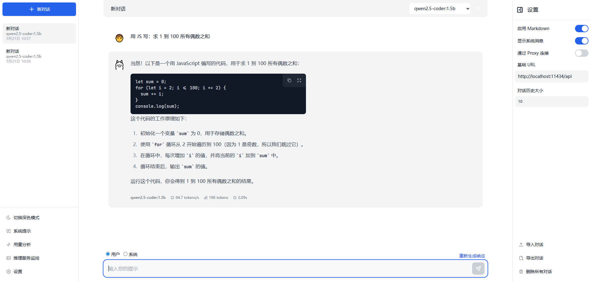
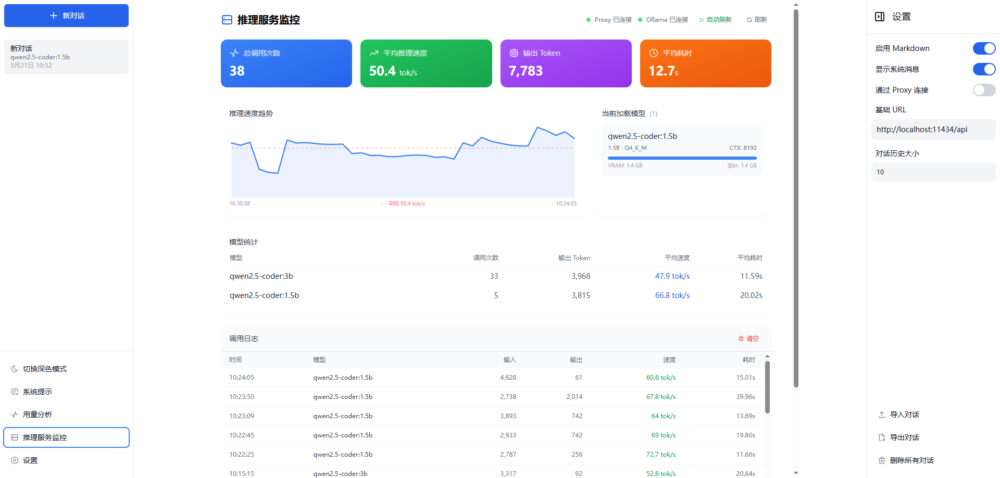

<p align="center">
  
</p>

<h1 align="center">Ollama GUI 中文版</h1>
<p align="center">一个现代化的本地大语言模型 Web 聊天界面，基于 Ollama 构建</p>

<p align="center">
  <a href="https://ollama.ai">
    
  </a>
  <a href="https://github.com/yangwenyu-ck/ollama-gui-zh/blob/main/LICENSE.md">
    
  </a>
</p>

## ✨ 功能特性

- 🖥️ 简洁现代的 Web 界面，与 Ollama 本地模型流畅对话
- 💾 基于 IndexedDB 的本地聊天记录持久化存储
- 📝 完整的 Markdown 渲染 + 代码语法高亮 + 一键复制代码
- 🌙 深色/浅色主题切换
- 🤖 多模型支持 — 自动加载本地已安装模型，每个对话可绑定不同模型
- ⚙️ 系统提示词配置 — 支持全局默认提示和按模型自定义提示
- 📊 用量分析面板 — 监控通过 Web 聊天界面（Ollama 原生 API）产生的 Token 用量、对话次数、响应速度等数据
- 🖥️ 推理服务监控 — 监控通过代理服务（端口 11435）发起的所有 API 调用，适用于 Trae IDE、Continue 等外部工具的推理日志、模型状态、VRAM 占用、速度趋势
- 📥 对话导入/导出 — 支持 JSON 格式导入导出，方便数据备份迁移
- 🌐 OpenAI 兼容代理 — 内置代理服务器提供 OpenAI 格式 API，可对接 Trae IDE、Continue 等工具，同时自动记录每次推理请求
- 🔒 隐私优先 — 所有数据存储在浏览器本地，处理完全在本地完成
- 🐳 Docker 一键部署

## 🚀 快速开始

### 环境要求

1. 安装 [Ollama](https://ollama.ai/download)
2. 安装 [Node.js](https://nodejs.org/)（v18+）和 [Yarn](https://classic.yarnpkg.com/lang/en/docs/install)

### 本地开发

```bash
# 启动 Ollama 服务并拉取模型
ollama pull mistral  # 或任意其他模型
ollama serve

# 克隆并运行 GUI
git clone https://github.com/yangwenyu-ck/ollama-gui-zh.git
cd ollama-gui-zh
yarn install / npm install
yarn dev / npm run dev
```

#### 局域网访问（仅开发模式）

开发服务器内置代理，可将 API 请求转发到本地 Ollama 实例，局域网内其他设备可同时访问 UI 和 API：

```bash
# 启动支持局域网访问的开发服务器
yarn dev --host

# 其他设备通过本机 IP 访问
# 例如：http://192.168.1.100:5173
```

> **注意：** 代理功能仅在 `yarn dev` 开发模式下可用。生产环境请配置 Ollama CORS 或使用反向代理。

禁用代理（例如使用自定义 Ollama 端点时）：
```bash
VITE_NO_PROXY=true yarn dev
```

### Docker 部署

Docker 方案同时运行 Ollama 和 GUI，无需额外配置代理或 CORS，只需安装 `docker` 即可。

> 如果有 NVIDIA GPU，请在 `compose.yml` 中取消以下注释：
```Dockerfile
    # deploy:
    #   resources:
    #     reservations:
    #       devices:
    #         - driver: nvidia
    #           count: all
    #           capabilities: [gpu]
```

#### 启动
```bash
docker compose up -d

# 访问 http://localhost:8080
```

#### 停止
```bash
docker compose down
```

#### 下载更多模型
```bash
# 进入 ollama 容器
docker exec -it ollama bash

# 在容器内下载模型
ollama pull <模型名称>

# 示例
ollama pull deepseek-r1:7b
```

使用 `docker compose restart` 重启容器。模型数据保存在项目目录下的 `./ollama_data` 文件夹中，可在 `compose.yml` 中修改路径。

## 🌐 核心架构：代理服务与推理监控

本项目的核心亮点在于内置了一个 **OpenAI 兼容代理服务器**（[proxy/server.cjs](proxy/server.cjs)），它不仅仅是简单的请求转发，更是一个完整的 **AI 推理网关**。

<p align="center">
  
</p>

### 工作原理

项目运行后会提供两个服务地址，各自承担不同的职责：

| 服务 | 地址 | 用途 |
|---|---|---|
| **Ollama 原生 API** | `http://localhost:11434` | Ollama 默认端口，Web 聊天界面直接调用，用量数据记录在「用量分析」面板 |
| **代理服务** | `http://localhost:11435` | OpenAI 兼容格式，所有外部工具（Trae、Continue 等）通过此端口调用，调用日志记录在「推理服务监控」面板 |

```
┌─────────────────┐     ┌──────────────────┐     ┌─────────────┐
│   Trae IDE      │     │  Ollama GUI 中文版 │     │   Ollama    │
│   Continue      │────▶│  (代理 11435)     │────▶│  (11434)    │
│   其他 AI 工具   │     │  📊 推理监控      │     │  本地大模型  │
└─────────────────┘     └──────────────────┘     └─────────────┘
```

### 设置面板中的「通过 Proxy 连接」

在 Web 界面的**设置面板**中，有一个 **「通过 Proxy 连接」** 开关按钮，用于控制 Web 聊天界面自身的 API 连接方式：

| 开关状态 | Web 聊天界面连接地址 | 说明 |
|---|---|---|
| **关闭**（默认） | `http://localhost:11434`（Ollama 原生） | 直接调用 Ollama，对话数据记录在「用量分析」面板 |
| **开启** | `http://localhost:11435`（代理服务） | 经过代理调用，Web 界面的对话也会被记录到「推理服务监控」面板 |

> **用途：** 此开关主要用于**本地测试**。开启后，你可以验证代理服务是否正常工作，同时在「推理服务监控」面板中观察 Web 界面自身的调用日志。日常使用时保持关闭即可。

### 为什么使用代理地址？

将 AI 工具的 API 请求地址从 `localhost:11434` 改为 `localhost:11435` 后，所有经过代理的请求都会被**自动记录**，你可以在 Web 界面的「推理服务监控」面板中实时查看：

- 📈 **每次调用的详细信息** — 模型名称、输入/Output Token 数、推理速度（tok/s）、耗时
- 🚀 **运行中模型状态** — 当前加载的模型、VRAM 占用、上下文长度、量化级别
- 📊 **速度趋势图** — 实时可视化推理速度变化
- 🔍 **按模型统计** — 各模型的调用次数、平均速度、总 Token 消耗

### 两个监控面板的区别

| 面板 | 监控对象 | 数据来源 | 适用场景 |
|---|---|---|---|
| **用量分析** | Web 聊天界面的对话 | Ollama 原生 API（11434） | 查看在 Web 界面中与模型对话的 Token 消耗和响应速度 |
| **推理服务监控** | 代理服务的所有 API 调用 | 代理服务（11435） | 监控 Trae IDE、Continue 等外部工具调用本地大模型的详细日志和性能 |

> **简单理解：** 用量分析 = 看你在网页上聊了多少；推理服务监控 = 看外部工具用了多少次、速度如何。

### 快速启动

```bash
# 1. 启动 Ollama
ollama serve

# 2. 启动代理服务（保持运行，用于监控外部工具调用）
npm run proxy

# 3. 在 Trae IDE / Continue 等工具中配置：
#    API 地址改为 http://localhost:11435
```

### OpenAI 兼容端点

代理提供标准的 OpenAI Chat Completions 格式，可直接被主流 AI 开发工具调用：

| 端点 | 说明 |
|---|---|
| `POST /v1/chat/completions` | 聊天补全（支持流式输出） |
| `GET /v1/models` | 获取可用模型列表 |

### 监控 API 端点

| 端点 | 说明 |
|---|---|
| `GET /monitor/stats` | 推理统计概览（总调用数、总 Token、平均速度） |
| `GET /monitor/logs?limit=100` | 推理日志列表（支持分页和模型筛选） |
| `GET /monitor/ps` | 当前运行中的模型状态 |
| `GET /monitor/speed-trend?limit=80` | 速度趋势数据（用于图表渲染） |
| `POST /monitor/clear` | 清空推理日志 |

## 🏭 生产部署

构建生产版本（`yarn build`）后生成静态文件，不包含代理服务器。有以下部署方案：

### 方案一：配置 Ollama CORS
```bash
OLLAMA_ORIGINS=https://your-domain.com ollama serve
```

### 方案二：使用反向代理
配置 Nginx / Apache / Caddy 将 `/api` 请求转发到 Ollama 实例。

### 方案三：使用 Docker Compose
```bash
docker compose up -d
```

## 🛣️ 路线图

- [x] 基于 IndexedDB 的聊天历史存储
- [x] Markdown 消息格式化 + 代码高亮
- [x] 深色/浅色主题切换
- [x] 多模型管理与切换
- [x] 系统提示词配置
- [x] 用量分析面板
- [x] 推理服务监控面板
- [x] 对话导入/导出
- [x] OpenAI 兼容代理服务器
- [ ] 模型库浏览与一键安装
- [ ] 移动端响应式适配
- [ ] 文件上传与 OCR 支持

## 🛠️ 技术栈

- [Vue.js 3](https://vuejs.org/) — 前端框架（Composition API + TypeScript）
- [Vite 5](https://vitejs.dev/) — 构建工具
- [Tailwind CSS](https://tailwindcss.com/) — 样式框架
- [Dexie.js](https://dexie.org/) — IndexedDB 封装
- [markdown-it](https://github.com/markdown-it/markdown-it) + [highlight.js](https://highlightjs.org/) — Markdown 渲染与代码高亮
- [VueUse](https://vueuse.org/) — Vue 组合式工具库
- [@tabler/icons-vue](https://github.com/tabler/icons-vue) — 图标库
- [Docker](https://www.docker.com/) + Nginx — 容器化部署

设计灵感来源于 [LangUI](https://www.langui.dev/)，基于 [HelgeSverre/ollama-gui](https://github.com/HelgeSverre/ollama-gui) 二次开发。

## 📄 许可证

本项目基于 [MIT 协议](LICENSE.md) 开源。
